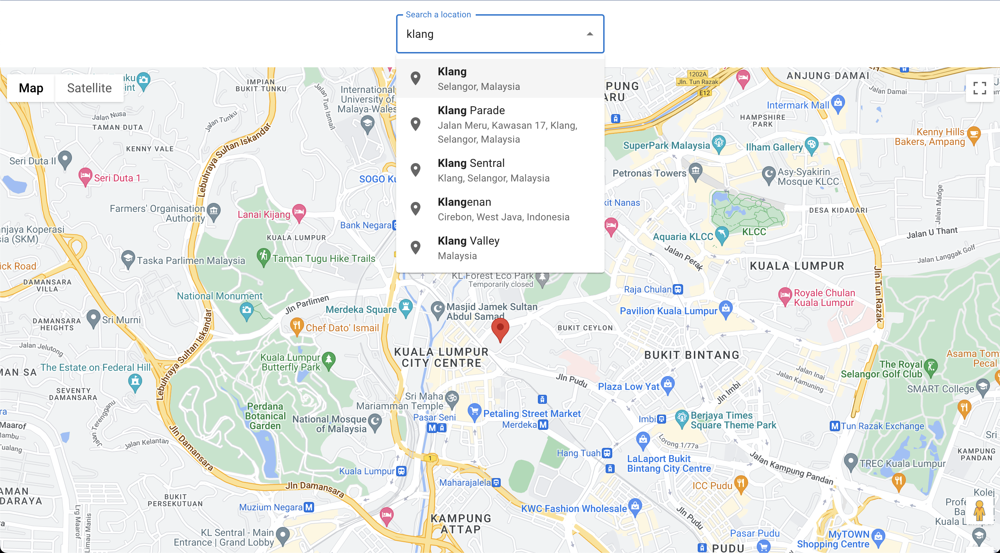

# Hello. 
This is a google map react application using redux-saga.
Please define an env file with a key REACT_APP_GOOGLE_MAP_API_KEY for the project to work.
Have a nice day :)

## Features. 
### Auto complete text box integrated with Google Places Api

### History Search List with easy click to recheck or delete previous locations

### History List display limit responsive with viewport size (mobile and desktop)

## Future Enhancement
- avoid adding of duplicated location